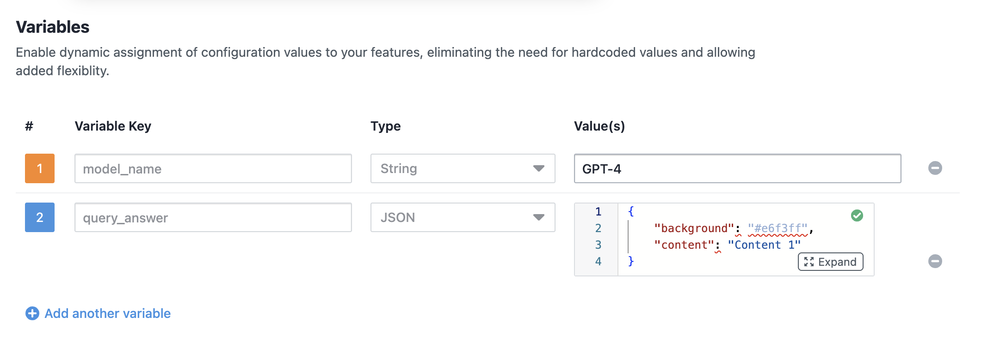

3. Set below environment variables in `local.properties`.

    ```properties
   FME_ACCOUNT_ID=
   FME_SDK_KEY=
   FLAG_NAME=
   EVENT_NAME=
   VARIABLE_1_KEY=
   VARIABLE_2_KEY=
   VARIABLE_2_CONTENT=
   VARIABLE_2_BG=
   MAX_LOG_MESSAGES=
   # Add mixpanel token here if you want to track events in Mixpanel
   MIXPANEL_PROJECT_TOKEN=
    ```

# 🤖 Smart Bot with VWO FME Integration

> A simple example mobile application showcasing VWO Feature Management and Experimentation (Android SDK) integration, enabling dynamic feature flags and user interaction tracking.

## ✨ Example App Features

- 🎯 User ID-based feature flag evaluation
- 🚦 Feature flag status checking
- 📊 SDK log monitoring
- 🌐 Interactive interface
- 📈 Event tracking capabilities
- 🎨 User attributes management

## 🚀 Prerequisites

Before you begin, ensure you have:

- Android Studio
- FME product enabled for your VWO account

## 💻 Installation

1. Clone the repository:

    ```kotlin
    git clone https://github.com/wingify/vwo-fme-examples.git
    cd vwo-fme-examples/android
    ```

2. Open vwo-fme-examples/android in Android studio.

3. Set below environment variables in `local.properties`.

    ```properties
   FME_ACCOUNT_ID=
   FME_SDK_KEY=
   FLAG_NAME=
   EVENT_NAME=
   VARIABLE_1_KEY=
   VARIABLE_2_KEY=
   VARIABLE_2_CONTENT=
   VARIABLE_2_BG=
   MAX_LOG_MESSAGES=
   # Add mixpanel token here if you want to track events in Mixpanel
   MIXPANEL_PROJECT_TOKEN=
    ```

## 🔧 Usage

### Client Setup

🎨 Transform your application with VWO's powerful Feature Flags and Experimentation! This example showcases an intelligent way to:

✨ **Dynamic AI Model Switching**

- Seamlessly switch between different LLM models from AI companies.
- Customise and test your experience in real-time based on user context

🎯 **Smart Content Management**

- Fine-tune response content through intuitive flag variables
- Control UI elements with precision
- Personalize user experiences on the fly

🧪 **Experimentation Made Easy**

- Run sophisticated A/B tests combining different AI models
- Test various UI combinations effortlessly
- Measure and optimize performance in real-time

### Steps to Implement

1. **Create a Feature Flag in VWO FME:**
   - **Name:** `FME Example Smart Bot`
   - **Variables:**
     - `model_name` with default value `GPT-4`
     - `query_answer` with default value `{"background":"#e6f3ff","content":"Content 1"}`

     - 


2. **Create Variations:**
   - **Variation 1:**
     - `model_name`: `Claude 2`
     - `query_answer`: `{"background":"#e6ffe6","content":"Content 2"}`
   - **Variation 2:**
     - `model_name`: `Gemini Pro`
     - `query_answer`: `{"background": "#fffff0", "content": "Content 3"}`
   - **Variation 3:**
     - `model_name`: `LLaMA 2`
     - `query_answer`: `{"background": "#ffe6cc", "content": "Content 4"}`

     - 

3. **Create a Rollout and Testing Rule:**
   - Set up the feature flag with the above variations.

4. **Configure Your android App:**
   - Set below environment variables in `local.properties`.

    ```properties
   FME_ACCOUNT_ID=
   FME_SDK_KEY=
   FLAG_NAME=
   EVENT_NAME=
   VARIABLE_1_KEY=
   VARIABLE_2_KEY=
   VARIABLE_2_CONTENT=
   VARIABLE_2_BG=
   MAX_LOG_MESSAGES=
   # Add mixpanel token here if you want to track events in Mixpanel
   MIXPANEL_PROJECT_TOKEN=
    ```

5. **Run the App in Android Studio:**
   - Use the Emulator to test the app.

6. **Interact with the App:**
   - Enter a unique `user ID` (or assign a random `user ID`) and tap the `send` button to see the feature flag in action.
   - Observe the query response and model name change based on the feature flag variation.

       - 

    - You will see that the query response and model name is changed based on the feature flag variation.
        - 

    - You can also check the SDK logs using the `Show logs` button.
        - 

7. **Check SDK Logs:**
   - Use the `Show logs` button to view SDK logs.

## 📊 Analytics Integration with Mixpanel

VWO FME SDK provides integration capabilities with analytics platforms like Mixpanel. This allows you to track feature flag evaluations and events in your analytics dashboard.

### Kotlin Implementation

```kotlin
// 1. Create a MixpanelIntegration class
import android.content
import com.mixpanel.android.mpmetrics.MixpanelAPI
import org.json.JSONObject

class MixpanelIntegration private constructor(context: Context, projectToken: String) {
    private val mixpanel: MixpanelAPI = MixpanelAPI.getInstance(context, projectToken, true)
    
    companion object {
        @Volatile
        private var instance: MixpanelIntegration? = null
        
        fun getInstance(context: Context, projectToken: String): MixpanelIntegration {
            return instance ?: synchronized(this) {
                instance ?: MixpanelIntegration(context, projectToken).also { instance = it }
            }
        }
    }
    
    fun trackEvent(eventName: String, properties: Map<String, Any>) {
        val props = JSONObject()
        properties.forEach { (key, value) ->
            props.put(key, value)
        }
        mixpanel.track("vwo_fme_track_event", props)
    }
    
    fun trackFlagEvaluation(properties: Map<String, Any>) {
        mixpanel.trackMap("vwo_fme_flag_evaluation", properties)
    }
}

// 2. Initialize Mixpanel and set up integration callback
val mixpanelToken = BuildConfig.MIXPANEL_PROJECT_TOKEN
mixpanelIntegration = MixpanelIntegration.getInstance(context, mixpanelToken)

initOptions.integrations = object : IntegrationCallback {
    override fun execute(properties: Map<String, Any>) {
        // Check if this is a flag evaluation or event tracking
        if (properties["api"] == "track") {
            // This is event tracking
            val eventName = properties["eventName"] as String
            mixpanelIntegration?.trackEvent(eventName, properties)
        } else if (properties.containsKey("featureName")) {
            // This is a flag evaluation
            mixpanelIntegration?.trackFlagEvaluation(properties)
        }
    }
}
```

### Java Implementation

```java
// 1. Create a MixpanelIntegration class
import android.content.Context;
import com.mixpanel.android.mpmetrics.MixpanelAPI;
import org.json.JSONException;
import org.json.JSONObject;
import java.util.Map;

public class MixpanelIntegration {
    private static volatile MixpanelIntegration instance;
    private final MixpanelAPI mixpanel;

    private MixpanelIntegration(Context context, String projectToken) {
        mixpanel = MixpanelAPI.getInstance(context, projectToken, true);
    }

    public static MixpanelIntegration getInstance(Context context, String projectToken) {
        if (instance == null) {
            synchronized (MixpanelIntegration.class) {
                if (instance == null) {
                    instance = new MixpanelIntegration(context, projectToken);
                }
            }
        }
        return instance;
    }

    public void trackEvent(String eventName, Map<String, Object> properties) {
        JSONObject props = new JSONObject();
        for (Map.Entry<String, Object> entry : properties.entrySet()) {
            try {
                props.put(entry.getKey(), entry.getValue());
            } catch (JSONException e) {
                e.printStackTrace();
            }
        }
        mixpanel.track("vwo_fme_track_event", props);
    }

    public void trackFlagEvaluation(Map<String, Object> properties) {
        mixpanel.trackMap("vwo_fme_flag_evaluation", properties);
    }
}

// 2. Initialize Mixpanel and set up integration callback
String mixpanelToken = BuildConfig.MIXPANEL_PROJECT_TOKEN;
final MixpanelIntegration mixpanelIntegration = MixpanelIntegration.getInstance(context, mixpanelToken);

VWOInitOptions initOptions = new VWOInitOptions();
initOptions.setIntegrations(new IntegrationCallback() {
    @Override
    public void execute(Map<String, Object> properties) {
        // Check if this is a flag evaluation or event tracking
        if ("track".equals(properties.get("api"))) {
            // This is event tracking
            String eventName = (String) properties.get("eventName");
            mixpanelIntegration.trackEvent(eventName, properties);
        } else if (properties.containsKey("featureName")) {
            // This is a flag evaluation
            mixpanelIntegration.trackFlagEvaluation(properties);
        }
    }
});
```

### Integration Data

When using the integration callback, you'll receive the following data:

- **For flag evaluations**: 
  ```
  {
    featureName: "yourFlagName", 
    featureId: 5, 
    featureKey: "yourFlagKey", 
    userId: "0duMh1j7krRB",
    ...
  }
  ```

- **For event tracking**: 
  ```
  {
    eventName: "yourEventName", 
    api: "track"
  }
  ```

Don't forget to add your Mixpanel project token to your `local.properties` file:
```
MIXPANEL_PROJECT_TOKEN=YOUR_PROJECT_TOKEN
```
Upon successful integration, you'll see the events in Mixpanel:


### Screenshots

    
