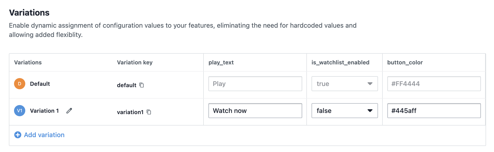
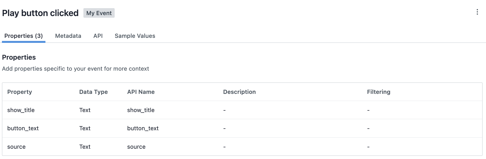
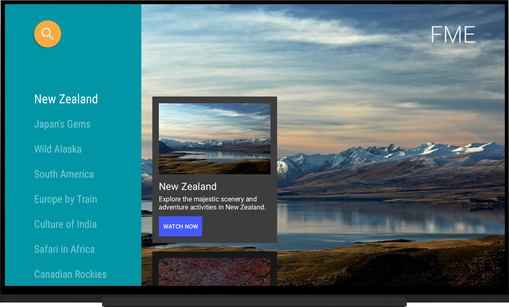
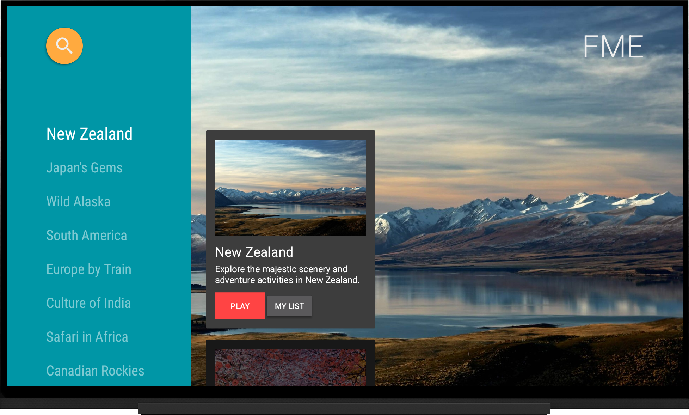

# TravelApp - VWO FME Android TV Example

A demonstration Android TV application showcasing VWO Feature Management and Experimentation (FME) SDK integration for customizable UI elements and user interaction tracking. Browse through stunning travel destinations and plan your next adventure!

## 📱 Example App Features

### 🎨 Customizable UI Elements
- **Play Button Color**: Dynamically change play button background color via VWO feature flags
- **Play Button Text**: Customize button text ("Play", "Watch Now") through feature variables
- **Watchlist Button Visibility**: Show/hide "My List" button based on feature flag configuration

### 📊 User Interaction Tracking with VWO FME SDK
- **Play Button Click Tracking**: Automatically tracks when users click play buttons with metadata
- **Custom Event Properties**: Tracks additional context like video title, button text, and interaction source

### 🚀 VWO FME Integration
- **Feature Flag Management**: Real-time feature toggling without app updates
- **A/B Testing**: Test different UI variations and measure user engagement
- **Remote Configuration**: Modify app behavior and appearance remotely

## 📋 Prerequisites

- **Android Studio**: Arctic Fox (2020.3.1) or later
- **Android SDK**: API level 21 (Android 5.0) or higher
- **Target SDK**: API level 34
- **Kotlin**: 1.9.0 or later
- **VWO Account**: Active VWO FME account with SDK key and account ID

## 🛠 Installation

1. **Clone the repository**
   ```bash
   git clone <repository-url>
   cd TravelApp
   ```

2. **Configure VWO FME Settings**
   
   Update the `local.properties` file with your VWO configuration:
   ```properties
   # VWO FME SDK Configuration
   vwo.sdk.key=YOUR_VWO_SDK_KEY
   vwo.account.id=YOUR_VWO_ACCOUNT_ID
   
   # Feature Flag Names
   vwo.flag.android_tv=android_tv_flag
   vwo.event.play=playButtonClicked
   vwo.variable.play_text=play_text
   vwo.variable.button_color=button_color
   vwo.variable.watchlist_enabled=is_watchlist_enabled
   ```

3. **Build and Run**
   ```bash
   ./gradlew build
   ./gradlew installDebug
   ```

## 🎯 Usage

### VWO FME Dashboard Configuration

Based on the `local.properties` configuration, create the following in your VWO FME dashboard:

#### 1. Feature Flag Setup
- **Flag Name**: `android_tv_flag`
- **Description**: Controls Android TV app UI customizations
- **Status**: Active

#### 2. Feature Variables
Create these variables under the `android_tv_flag`:

| Variable Name | Type | Description | Example Values |
|---------------|------|-------------|----------------|
| `play_text` | String | Text displayed on play button | "Play", "Watch Now", "Start Watching" |
| `button_color` | String | Hex color code for play button | "#FF4444", "#00FF00", "#0066CC" |
| `is_watchlist_enabled` | Boolean | Show/hide watchlist button | true, false |

#### 3. Custom Events
Set up tracking for these events:

| Event Name | Description | Properties |
|------------|-------------|------------|
| `playButtonClicked` | Triggered when user clicks play button | `video_title`, `button_text`, `source` |

### App Usage Flow

1. **Launch the App**: The app initializes VWO FME SDK on startup
2. **Loading Screen**: Shows initialization progress with VWO integration
3. **Travel Videos Grid**: Browse through amazing travel destinations with dynamic UI elements
4. **Interaction Tracking**: All button clicks are automatically tracked and sent to VWO

### Feature Flag Testing

Test different variations by modifying feature variables in VWO dashboard:

- **Play Button Color**: Change `button_color` to test different color schemes
- **Button Text**: Modify `play_text` to test engagement with different CTAs
- **Watchlist Feature**: Toggle `is_watchlist_enabled` to A/B test feature adoption

## 📸 Screenshots

### Variations in Action
Create variations for feature flag:


### Event in Action
Create a custom event to track user interactions:


### App Screenshots
| Feature Comparison                |
|-----------------------------------|
|  |
|  |

## 🔧 Configuration Details

### VWO FME Manager Features

The `VwoFmeManager` class provides:

- **Automatic SDK Initialization**: Handles VWO SDK setup and configuration
- **Feature Flag Retrieval**: Fetches and caches feature flags
- **Event Tracking**: Simplified event tracking with custom properties
- **Fallback Handling**: Graceful degradation when VWO is unavailable

### Build Configuration

The app automatically injects VWO configuration from `local.properties` into `BuildConfig`:

```kotlin
buildConfigField("String", "VWO_SDK_KEY", "\"${properties.getProperty("vwo.sdk.key")}\"")
buildConfigField("String", "VWO_ACCOUNT_ID", "\"${properties.getProperty("vwo.account.id")}\"")
```

## 🚀 Getting Started with VWO FME

1. **Sign up** for a VWO account at [vwo.com](https://vwo.com)
4. **Set up feature flags** as described in the Usage section
3. **Copy your SDK key and Account ID** to `local.properties`
5. **Run the app** and start experimenting with different variations

## 📱 Platform Support

- **Android TV**: Primary target platform
- **Min SDK**: API 21 (Android 5.0)
- **Target SDK**: API 34 (Android 14)
- **Architecture**: Uses Android Leanback library for TV interface
