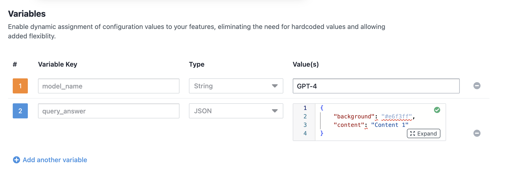
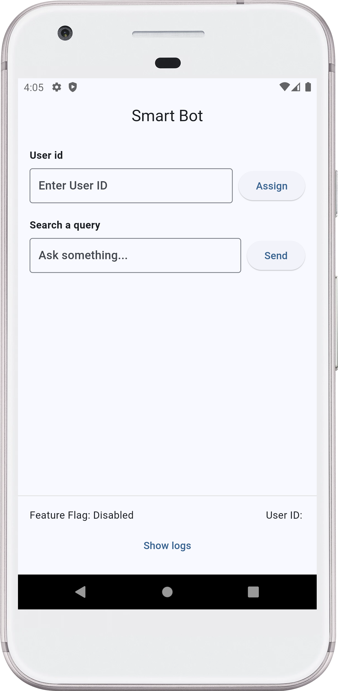
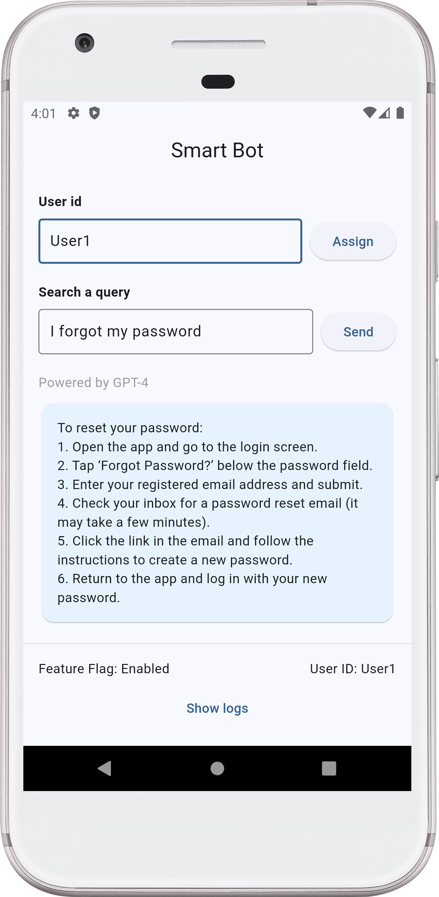
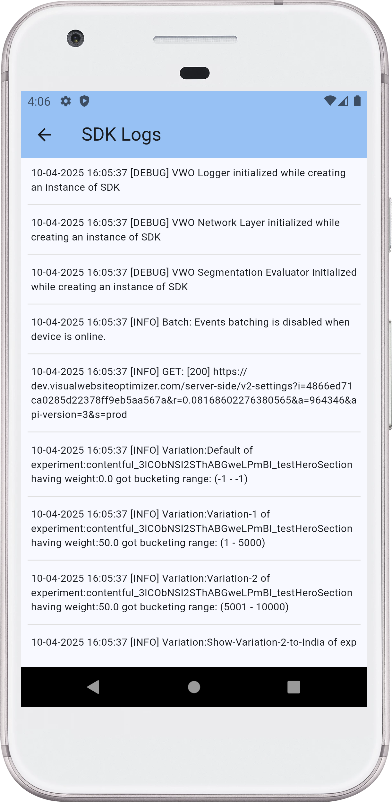
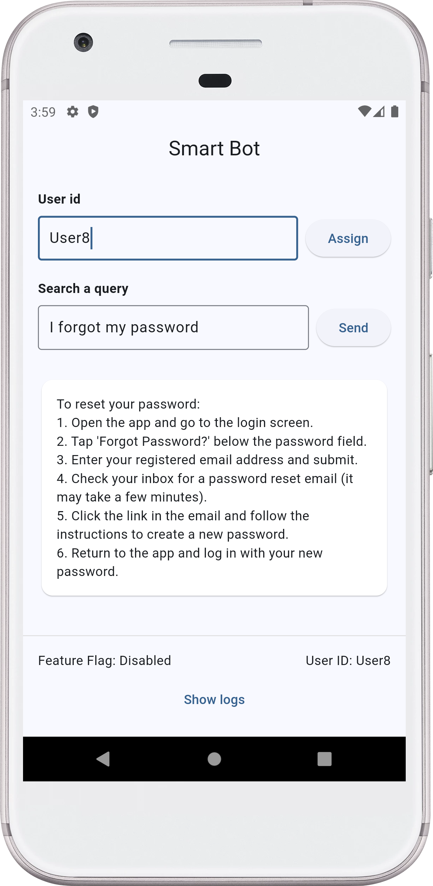
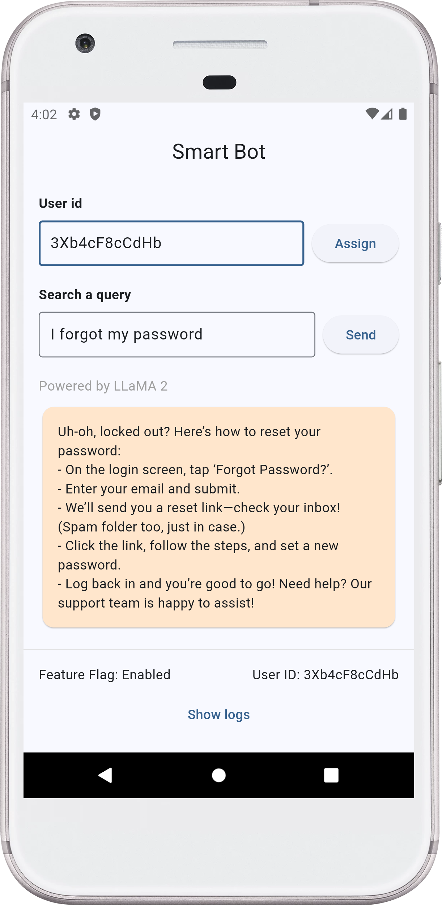
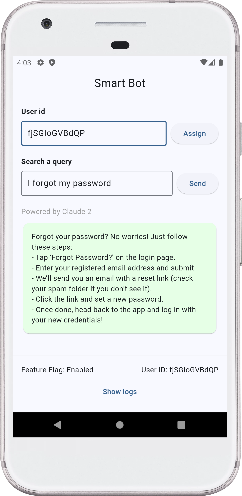
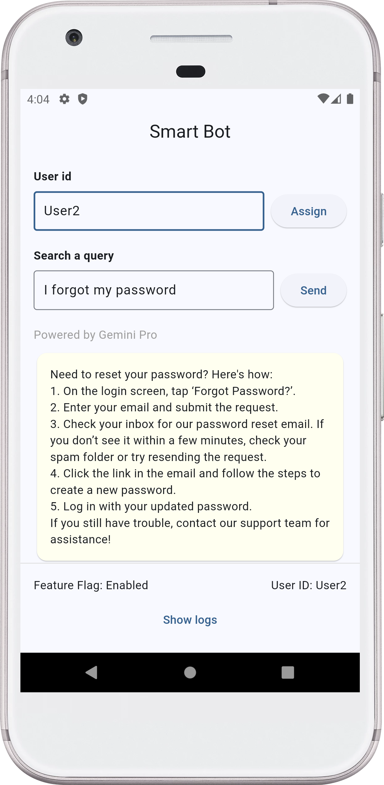

# 🤖 Smart Bot with VWO FME Integration

> A simple example mobile application showcasing VWO Feature Management and Experimentation (Flutter SDK) integration, enabling dynamic feature flags and user interaction tracking.

## ✨ Example App Features

- 🎯 User ID-based feature flag evaluation
- 🚦 Feature flag status checking
- 📊 SDK log monitoring
- 🌐 Interactive interface
- 📈 Event tracking capabilities
- 🎨 User attributes management

## 🚀 Prerequisites

Before you begin, ensure you have:

- Flutter SDK
- FME product enabled for your VWO account

## 💻 Installation

1. Clone the repository:

    ```bash
    git clone https://github.com/wingify/vwo-fme-examples.git
    cd vwo-fme-examples/flutter
    ```

2. Open `vwo-fme-examples/flutter` in Android studio.

3. Create and set below environment variables in `.env` file.

    ```bash
   FME_ACCOUNT_ID=
   FME_SDK_KEY=
   FLAG_NAME=
   EVENT_NAME=
   VARIABLE_1_KEY=
   VARIABLE_2_KEY=
   VARIABLE_2_CONTENT=
   VARIABLE_2_BG=
   MAX_LOG_MESSAGES=
    ```

## 🔧 Usage

### Client Setup

🎨 Transform your application with VWO's powerful Feature Flags and Experimentation! This example showcases an intelligent way to:

✨ **Dynamic AI Model Switching**

- Seamlessly switch between different LLM models from AI companies.
- Customise and test your experience in real-time based on user context

🎯 **Smart Content Management**

- Fine-tune response content through intuitive flag variables
- Control UI elements with precision
- Personalize user experiences on the fly

🧪 **Experimentation Made Easy**

- Run sophisticated A/B tests combining different AI models
- Test various UI combinations effortlessly
- Measure and optimize performance in real-time

### Steps to Implement

1. **Create a Feature Flag in VWO FME:**
   - **Name:** `FME Example Smart Bot`
   - **Variables:**
     - `model_name` with default value `GPT-4`
     - `query_answer` with default value `{"background":"#e6f3ff","content":"Content 1"}`

     - 

2. **Create Variations:**
   - **Variation 1:**
     - `model_name`: `Claude 2`
     - `query_answer`: `{"background":"#e6ffe6","content":"Content 2"}`
   - **Variation 2:**
     - `model_name`: `Gemini Pro`
     - `query_answer`: `{"background": "#fffff0", "content": "Content 3"}`
   - **Variation 3:**
     - `model_name`: `LLaMA 2`
     - `query_answer`: `{"background": "#ffe6cc", "content": "Content 4"}`

     - 

3. **Create a Rollout and Testing Rule:**
   - Set up the feature flag with the above variations.

4. **Configure Your Flutter App:**
   - Create and set below environment variables in `.env` file.

    ```bash
   FME_ACCOUNT_ID=
   FME_SDK_KEY=
   FLAG_NAME=
   EVENT_NAME=
   VARIABLE_1_KEY=
   VARIABLE_2_KEY=
   VARIABLE_2_CONTENT=
   VARIABLE_2_BG=
   MAX_LOG_MESSAGES=
    ```

5. **Run the App:**
   - Use `flutter run` or `fvm flutter run`
   - Use the Emulator to test the app.

6. **Interact with the App:**
   - Enter a unique `user ID` (or assign a random `user ID`) and tap the `send` button to see the feature flag in action.
   - Observe the query response and model name change based on the feature flag variation.

       - 

    - You will see that the query response and model name is changed based on the feature flag variation.
        - 

    - You can also check the SDK logs using the `Show logs` button.
        - 

7. **Check SDK Logs:**
   - Use the `Show logs` button to view SDK logs.

### Screenshots

    
