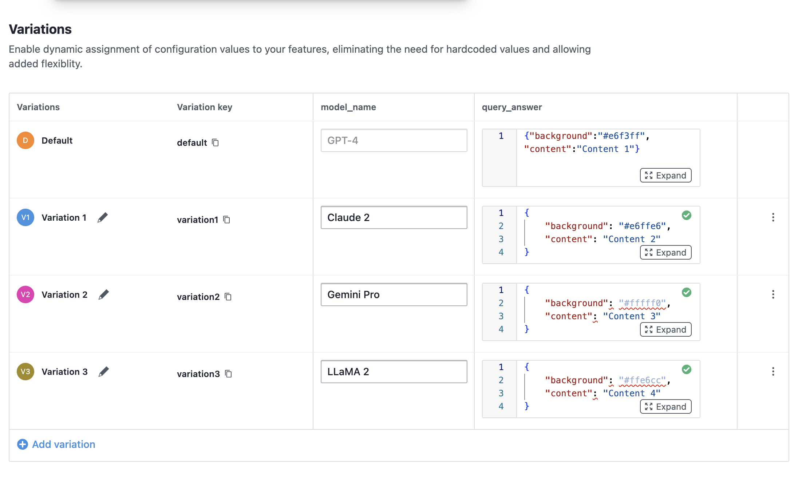

# 🤖 Smart Bot with VWO FME Integration

> A simple example web application showcasing VWO Feature Management and Experimentation (JavaScript SDK) integration, enabling dynamic feature flags and user interaction tracking.

## ✨ Example App Features

- 🎯 User ID-based feature flag evaluation
- 🚦 Feature flag status checking
- 🔄 Real-time settings visualization
- 📊 SDK log monitoring
- 🌐 Interactive web interface
- 📈 Event tracking capabilities
- 🎨 User attributes management

## 🚀 Prerequisites

Before you begin, ensure you have:

- Feature Management and Experimentation (FME) product enabled for your VWO account
- (For browser version) A modern web browser

---

## 🟦 Using VWO FME in a Browser

This project demonstrates how to use the `vwo-fme-javascript-sdk` directly in the browser.

- Config must be provided in `vwo-config.js`
    ```javascript
    // Replace with your actual values
    window.vwoConfig = {
        accountId: '123456', // VWO Account ID
        sdkKey: '32-alpha-numeric-sdk-key', // SDK Key,
        flagKey: 'feature-flag-key',
        eventName: 'event-name',
        attributes: {}, // e.g. { attr1: 'value1' }
        customVariables: {}, // e.g. { var1: 'value1' }
        logLevel: vwoSdk.LogLevelEnum.DEBUG,
        pollInterval: 5000,
        variablekey1: 'variable-key-1',
        variablekey2: 'variable-key-2',
    };
    ```

### How It Works
- The VWO SDK is loaded via a `<script>` tag in your `index.html`.
- Configuration is provided via `vwo-config.js`.
- All feature flag evaluation and event tracking happens in the browser.

### Example: Integrating the VWO FME JavaScript SDK in `index.html`

```html
<!-- Load the VWO FME JavaScript SDK -->
<script src="https://cdn.jsdelivr.net/npm/vwo-fme-node-sdk@1/dist/client/vwo-fme-javascript-sdk.min.js"></script>
```

## 💻 Installation

1. Clone the repository:

    ```bash
    git clone https://github.com/wingify/vwo-fme-examples.git
    cd vwo-fme-examples/javascript
    ```
2. Directly open `index.html` in your browser.

### Client Setup

🎨 Transform your application with VWO's powerful Feature Flags and Experimentation! This example showcases an intelligent way to:

✨ **Dynamic AI Model Switching**

- Seamlessly switch between different LLM models from AI companies.
- Customise and test your experience in real-time based on user context.

🎯 **Smart Content Management**

- Fine-tune response content through intuitive flag variables
- Control UI elements with precision
- Personalize user experiences on the fly

🧪 **Experimentation Made Easy**

- Run sophisticated A/B tests combining different AI models
- Test various UI combinations effortlessly
- Measure and optimize performance in real-time

### Steps to Implement

1. **Create a Feature Flag in VWO FME:**
    - **Name:** `FME Example Smart Bot`
    - **Variables:**
      - `model_name` with default value `GPT-4`
      - `query_answer` with default value `{"background":"#e6f3ff","content":"Content 1"}`

        - 

2. **Create Variations:**
   - **Variation 1:**
     - `model_name`: `Claude 2`
     - `query_answer`: `{"background":"#e6ffe6","content":"Content 2"}`
   - **Variation 2:**
     - `model_name`: `Gemini Pro`
     - `query_answer`: `{"background": "#fffff0", "content": "Content 3"}`
   - **Variation 3:**
     - `model_name`: `LLaMA 2`
     - `query_answer`: `{"background": "#ffe6cc", "content": "Content 4"}`

     - 

3. **Create a Rollout and Testing Rule:**
   - Set up the feature flag with the above variations.

4. **Add all config details** in the `vwo-config.js` file.

5. **Run the application**
    - open `index.html` directly on your browser.

6. **Interact with the App:**

    - Enter a unique `user ID` (you can also assign a random `user ID`) and click on the `send` button to see the feature flag in action.
        - 

    - You will see that the query response and model name is changed based on the feature flag variation.
        - 

    - You can also check the settings and SDK logs using the `Show settings` and `Show SDK Logs` buttons.
        - 
