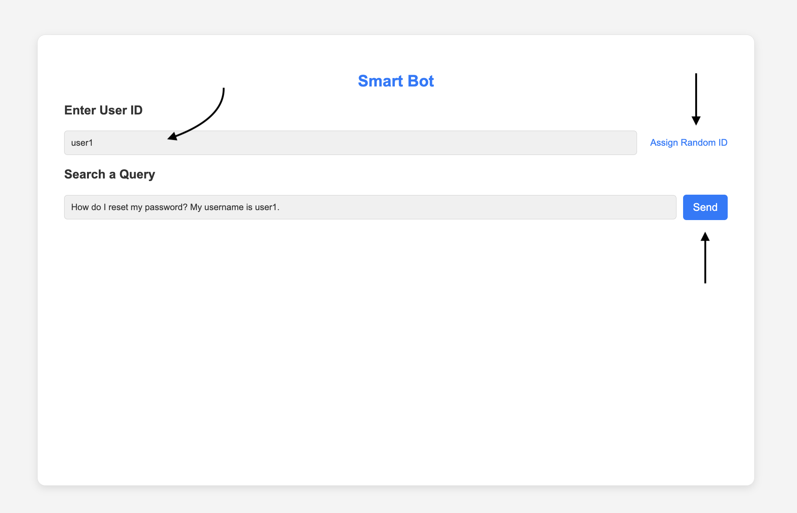
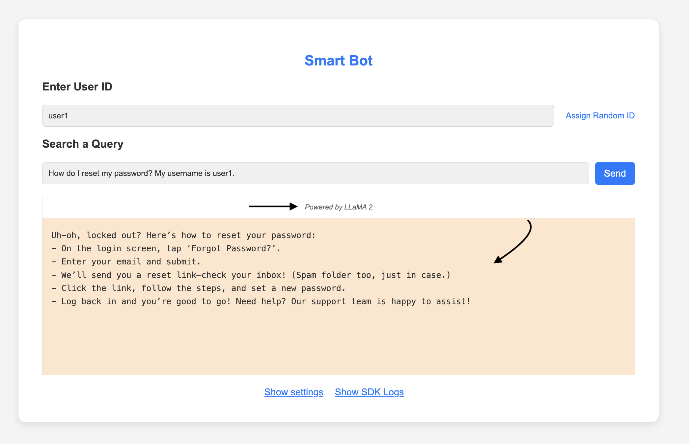
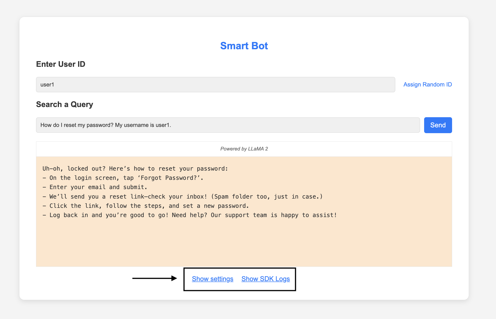

# 🤖 VWO FME Next.js Example

> A modern Next.js application showcasing VWO Feature Management and Experimentation (FME) SDK integration, enabling dynamic feature flags and user interaction tracking.

## ✨ Features

- 🎯 TypeScript support
- 🔧 Environment variables configuration
- 🧩 Component-based architecture
- 🚀 VWO FME SDK integration
- ⚡ Modern React patterns

## 🚀 Prerequisites

Before you begin, ensure you have:

- Node.js 14.x or later
- npm or yarn
- VWO account with FME access

## 💻 Setup

1. Clone the repository

2. Install dependencies:
   ```bash
   npm install
   ```

3. Create a `.env.local` file in the root directory with your VWO credentials:
   ```
   NEXT_PUBLIC_VWO_ACCOUNT_ID=your_account_id
   NEXT_PUBLIC_VWO_SDK_KEY=your_sdk_key
   NEXT_PUBLIC_VWO_FLAG_KEY=your_flag_key
   NEXT_PUBLIC_VWO_EVENT_NAME=your_event_name
   NEXT_PUBLIC_VWO_LOG_LEVEL=INFO
   NEXT_PUBLIC_VWO_VARIABLE_KEY_1=your_variable_key_1
   NEXT_PUBLIC_VWO_VARIABLE_KEY_2=your_variable_key_2
   ```

4. Run the development server:
   ```bash
   npm run dev
   ```

5. Open [http://localhost:3000](http://localhost:3000) in your browser

## 📁 Project Structure

```
nextjs/
├── components/     # Reusable React components
├── config/        # Configuration files
├── pages/         # Next.js pages
├── styles/        # CSS modules
├── types/         # TypeScript type definitions
├── .env.local     # Environment variables (create this)
├── next.config.js # Next.js configuration
└── package.json   # Project dependencies
```

## 🔧 Development

- `npm run dev` - Start development server
- `npm run build` - Build for production
- `npm run start` - Start production server
- `npm run lint` - Run ESLint

## ⚙️ Environment Variables

All environment variables are prefixed with `NEXT_PUBLIC_` to make them available on the client side. Required variables:

- `NEXT_PUBLIC_VWO_ACCOUNT_ID`: Your VWO account ID
- `NEXT_PUBLIC_VWO_SDK_KEY`: Your VWO SDK key
- `NEXT_PUBLIC_VWO_FLAG_KEY`: Your feature flag key

## 📝 TypeScript

This project uses TypeScript for better type safety and developer experience. The configuration is in `tsconfig.json`.

## 🧩 Components

The application is built using a component-based architecture:

- `Modal`: Reusable modal component
- `SearchForm`: User input form
- `ResponseDisplay`: Response display component

6. **Interact with the App:**

    - Open the application (http://localhost:3000) in the browser and you will see the smart bot application.

    - Enter a unique `user ID` (you can also assign a random `user ID`) and click on the `send` button to see the feature flag in action.
        - 

    - You will see that the query response and model name is changed based on the feature flag variation.
        - 

    - You can also check the settings and SDK logs using the `Show settings` and `Show SDK Logs` buttons.
        - 
