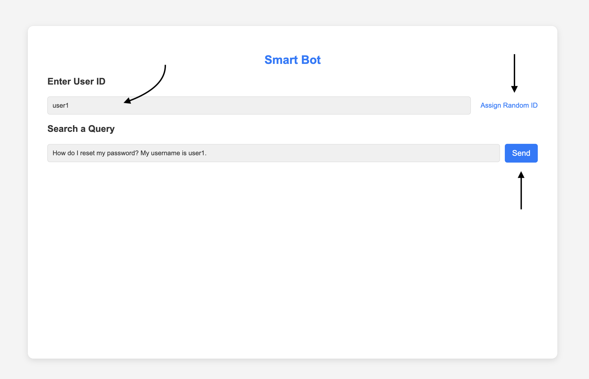

# 🤖 Smart Bot with VWO FME Integration

> A simple example web application showcasing VWO Feature Management and Experimentation (Node.js SDK) integration, enabling dynamic feature flags and user interaction tracking.

## ✨ Example App Features

- 🎯 User ID-based feature flag evaluation
- 🚦 Feature flag status checking
- 🔄 Real-time settings visualization
- 📊 SDK log monitoring
- 🌐 Interactive web interface
- 📈 Event tracking capabilities
- 🎨 User attributes management

## 🚀 Prerequisites

Before you begin, ensure you have:

- Node.js (v12 or higher)
- Feature Management and Experimentation(FME) product enabled for your VWO account

## 💻 Installation

1. Clone the repository:

    ```bash
    git clone https://github.com/wingify/vwo-fme-examples.git
    cd vwo-fme-node-sdk-example/node
    ```

2. Install dependencies:

    ```bash
    npm install
    # or
    yarn install
    ```

3. Set up your environment variables in `.env`:

    ```bash
    VWO_ACCOUNT_ID=vwo_account_id
    VWO_SDK_KEY=vwo_sdk_key
    VWO_FLAG_KEY=vwo_flag_key
    VWO_EVENT_NAME=vwo_event_name
    VWO_LOG_LEVEL=vwo_log_level # DEBUG, INFO, WARN, ERROR
    ```

## 🔧 Usage

### Server Setup

1. Launch the development server:

    ```bash
    npm run dev
    ```

2. Navigate to `http://localhost:3000` in your browser

### Client Setup

🎨 Transform your application with VWO's powerful Feature Flags and Experimentation! This example showcases an intelligent way to:

✨ **Dynamic AI Model Switching**

- Seamlessly switch between different LLM models from AI companies.
- Customise and test your experience in real-time based on user context

🎯 **Smart Content Management**

- Fine-tune response content through intuitive flag variables
- Control UI elements with precision
- Personalize user experiences on the fly

🧪 **Experimentation Made Easy**

- Run sophisticated A/B tests combining different AI models
- Test various UI combinations effortlessly
- Measure and optimize performance in real-time

1. Create a feature flag in VWO FME with the following settings:
    - Name: `FME Example Smart Bot`
    - Create variables with the following keys:
        - `model_name` with default value `GPT-4`
        - `query_answer` with default value `{"background":"#e6f3ff","content":"Content 1"}`

        - 

    - Create three variations with the following values:
        - <b>Variation 1</b>
            - <b>model_name</b>: `Claude 2`
            - <b>query_answer</b>: `{"background":"#e6ffe6","content":"Content 2"}`
        - <b>Variation 2</b>
            - <b>model_name</b>: `Gemini Pro`
            - <b>query_answer</b>: `{"background": "#fffff0", "content": "Content 3"}`
        - <b>Variation 3</b>
            - <b>model_name</b>: `LLaMA 2`
            - <b>query_answer</b>: `{"background": "#ffe6cc", "content": "Content 4"}`
           (As shown in the screenshot below)

        - 

    - Create a rollout and testing Rule for the above-created feature flag.

    - Add all config details in the `.env` file. As given in the [`.env.example`](./.env.example) file

    - Run the application using `npm run dev`

    - Open the application (http://localhost:3000) in the browser and you will see the smart bot application.

    - Enter a unique `user ID` (you can also assign a random `user ID`) and click on the `send` button to see the feature flag in action.
        - 

    - You will see that the query response and model name is changed based on the feature flag variation.
        - 

    - You can also check the settings and SDK logs using the `Show settings` and `Show SDK Logs` buttons.
        - 

## 🔌 API Endpoints

### GET /v1/get-flag

Evaluates and returns feature flag status and configurations for a specific user.

**Query Parameters:**

- `userId` (string): Unique identifier for the user

**Response Structure:**

- `isEnabled`: Flag status for the user
- `variables`: Feature flag variables
- `settings`: Current VWO SDK settings
- `logs`: SDK logs

**Flow:**

1. Receives user ID from query parameters.
2. Creates user context with ID and additional data (IP, user agent).
3. Evaluates feature flag using VWO SDK.
4. Retrieves current SDK settings and logs.
5. Returns combined response.

### GET /v1/track-event

Records user interactions and events in the VWO system for analytics.

**Query Parameters:**

- `userId` (string): Unique identifier for the user

**Response Structure:**

- `success`: Operation status

**Flow:**

1. Receives user ID from query parameters.
2. Creates user context with ID and additional data (IP, user agent).
3. Tracks event using VWO SDK.
4. Returns success/failure status.

### GET /v1/set-attribute

Sets custom attributes for user segmentation and targeting.

**Query Parameters:**

- `userId` (string): Unique identifier for the user

**Response Structure:**

- `success`: Operation status

**Flow:**

1. Receives user ID from query parameters
2. Creates user context with ID and additional data (IP, user agent)
3. Sets attributes using VWO SDK
4. Returns success/failure status

**Note:**

- All endpoints require a `userId` parameter for user identification
- If userId is not provided, a default value will be used
- Endpoints use VWO FME SDK for feature flag evaluation and user management
- Error responses include appropriate HTTP status codes with fallback values
- SDK initialization happens at startup
