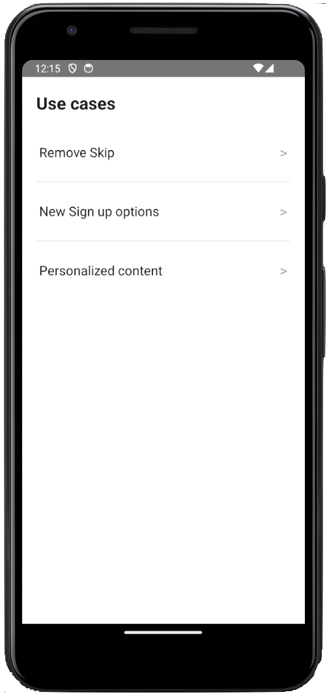
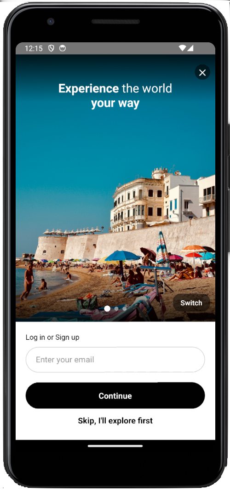
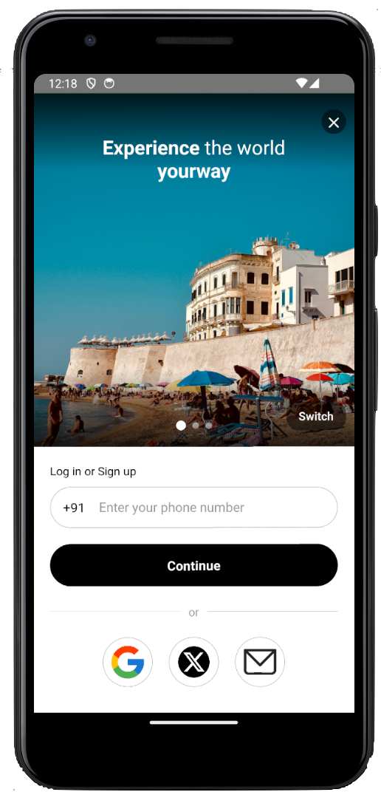
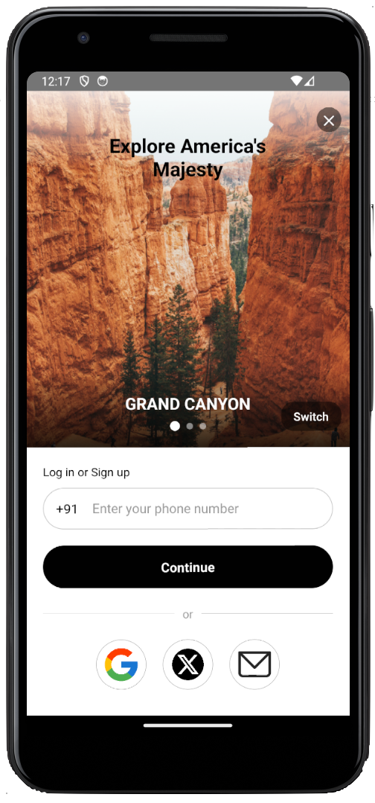

# 🤖 Onboarding UI with VWO FME Integration

> A simple example mobile application showcasing VWO Feature Management and Experimentation (React Native SDK) integration, enabling dynamic feature flags.

## ✨ Example App Features

- 🎯 User ID-based feature flag evaluation
- 🚦 Feature flag status checking

## 🚀 Prerequisites

Before you begin, ensure you have:

- React native setup [React Native docs](https://reactnative.dev/docs/environment-setup)
- Xcode and Android Studio for running app on respective platforms
- FME product enabled for your VWO account

## 💻 Installation

1. Clone the repository:

    ```bash
    git clone https://github.com/wingify/vwo-fme-examples.git
    cd vwo-fme-examples/react-native-onboarding-ui
    ```

2. Install dependencies:

    ```bash
    npm install
    # or
    yarn install
    ```

    For iOS, install the CocoaPods dependencies by running below command.

    ```bash
    cd ios && pod install
    ```

3. Create and set up your environment variables in `.env`:

    ```bash
    VWO_ACCOUNT_ID=vwo_account_id
    VWO_SDK_KEY=vwo_sdk_key
    VWO_FLAG_KEY_1=vwo_flag_use_case_key_1
    VWO_FLAG_KEY_2=vwo_flag_use_case_key_2
    VWO_FLAG_KEY_3=vwo_flag_use_case_key_3
    VWO_FLAG_JSON_VARIABLE_KEY=vwo_flag_json_variable_key
    VWO_FLAG_1_CONTROL_USER_ID=vwo_flag_1_user_id_for_control
    VWO_FLAG_1_VARIATION_USER_ID=vwo_flag_1_user_id_for_variation
    VWO_FLAG_2_CONTROL_USER_ID=vwo_flag_2_user_id_for_control
    VWO_FLAG_2_VARIATION_USER_ID=vwo_flag_2_user_id_for_variation
    VWO_FLAG_3_CONTROL_USER_ID=vwo_flag_3_user_id_for_control
    VWO_FLAG_3_VARIATION_USER_ID=vwo_flag_3_user_id_for_variation
    ```

#### Further Reading

- [React Native docs](https://reactnative.dev/docs/environment-setup)

## 🔧 Usage

### Client Setup

🎨 Transform your application with VWO's powerful Feature Flags and Experimentation! This example showcases an intelligent to use feature flags, you can seamlessly control your UI remotely through JSON variables, allowing for efficient A/B testing and phased rollouts :

✨ **Use cases**

This example demonstrates three powerful use cases of JSON variable control:

1. **Remove Skip Control**
   - Feature Flag: `VWO_FLAG_KEY_1`
   - Use Case: Controls the visibility of skip button in onboarding flow
   - Variations:
     - Control: Skip button visible
     - Variation: Skip button hidden

2. **New Sign Up Options**
   - Feature Flag: `VWO_FLAG_KEY_2`
   - Use Case: Controls different sign-up UI variations
   - Variations:
     - Control: Default sign-up flow
     - Variation 1: Enhanced sign-up experience

3. **Personalized Content**
   - Feature Flag: `VWO_FLAG_KEY_3`
   - Use Case: Location-based personalized content
   - Custom Variables: `{ location: 'US' }`
   - Variations:
     - Control: Default content
     - Experience 1: Location-specific content

### Steps to Implement

1. **Create a Feature Flag in VWO FME:**
   - Create three feature flags with JSON variables
   - Configure the JSON schema for each use case
   - Set up appropriate targeting rules

2. **Create Variations:**
   - For each feature flag, create control and variation states
   - Define JSON variables for each variation
   - Configure the UI elements to be controlled

3. **Create a Rollout and Testing Rule:**
   - Set up user targeting rules
   - Configure traffic allocation
   - Define custom variables for personalization

4. **Add all config details** in the `.env`

5. **Feature Flag Variables Reference:**
   The following variables from `VariationsJson.tsx` are used in the feature flags:

   a) **Remove Skip Control (VWO_FLAG_KEY_1)**
   - `RemoveSkipControl`
   - `RemoveSkipEnabled`

   b) **New Sign Up Options (VWO_FLAG_KEY_2)**
   - `SignUpControl`
   - `SignUpVariation`

   c) **Personalized Content (VWO_FLAG_KEY_3)**
   - `PersonalizeControl`
   - `PersonalizeLocation`

6. **Interact with the App:**
       
