# 🤖 Smart Bot with VWO FME Integration

> A simple example mobile application showcasing VWO Feature Management and Experimentation (React Native SDK) integration, enabling dynamic feature flags and user interaction tracking.

## ✨ Example App Features

- 🎯 User ID-based feature flag evaluation
- 🚦 Feature flag status checking
- 🔄 Real-time settings visualization
- 📊 SDK log monitoring
- 🌐 Interactive web interface
- 📈 Event tracking capabilities
- 🎨 User attributes management

## 🚀 Prerequisites

Before you begin, ensure you have:

- React native setup [React Native docs](https://reactnative.dev/docs/environment-setup)
- Xcode and Android Studio for running app on respective platforms
- FME product enabled for your VWO account

## 💻 Installation

1. Clone the repository:

    ```bash
    git clone https://github.com/wingify/vwo-fme-examples.git
    cd vwo-fme-examples/react-native
    ```

2. Install dependencies:

    ```bash
    npm install
    # or
    yarn install
    ```

    For iOS, install the CocoaPods dependencies by running below command.

    ```bash
    cd ios && pod install
    ```

3. Create and set up your environment variables in `.env`:

    ```bash
    VWO_ACCOUNT_ID=vwo_account_id
    VWO_SDK_KEY=vwo_sdk_key
    VWO_FLAG_KEY=vwo_flag_key
    VWO_FLAG_VARIABLE_1_KEY=vwo_flag_variable_key_1
    VWO_FLAG_VARIABLE_2_KEY=vwo_flag_variable_key_2
    VWO_EVENT_NAME=vwo_event_name
    ```

#### Further Reading

- [React Native docs](https://reactnative.dev/docs/environment-setup)

## 🔧 Usage

### Client Setup

🎨 Transform your application with VWO's powerful Feature Flags and Experimentation! This example showcases an intelligent way to:

✨ **Dynamic AI Model Switching**

- Seamlessly switch between different LLM models from AI companies.
- Customise and test your experience in real-time based on user context

🎯 **Smart Content Management**

- Fine-tune response content through intuitive flag variables
- Control UI elements with precision
- Personalize user experiences on the fly

🧪 **Experimentation Made Easy**

- Run sophisticated A/B tests combining different AI models
- Test various UI combinations effortlessly
- Measure and optimize performance in real-time

### Steps to Implement

1. **Create a Feature Flag in VWO FME:**
   - **Name:** `FME Example Smart Bot`
   - **Variables:**
     - `model_name` with default value `GPT-4`
     - `query_answer` with default value `{"background":"#e6f3ff","content":"Content 1"}`

     - 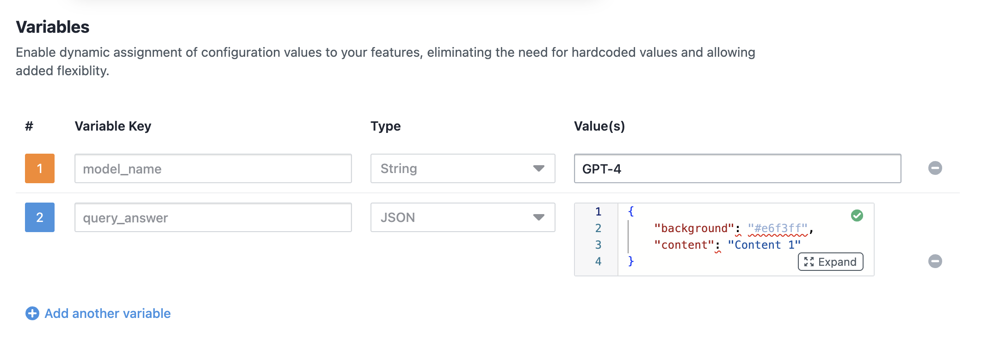


2. **Create Variations:**
   - **Variation 1:**
     - `model_name`: `Claude 2`
     - `query_answer`: `{"background":"#e6ffe6","content":"Content 2"}`
   - **Variation 2:**
     - `model_name`: `Gemini Pro`
     - `query_answer`: `{"background": "#fffff0", "content": "Content 3"}`
   - **Variation 3:**
     - `model_name`: `LLaMA 2`
     - `query_answer`: `{"background": "#ffe6cc", "content": "Content 4"}`

     - 

3. **Create a Rollout and Testing Rule:**
   - Set up the feature flag with the above variations.

4. **Add all config details** in the `.env` file. As given in the [`.env.example`](./.env.example) file

5. **Run the App on simulator:**

   - Android
      ```bash
      yarn android
      ```

   - iOS
     ```bash
      yarn ios
      ```

6. **Interact with the App:**

   - Enter a unique `user ID` (or assign a random `user ID`) and tap the `send` button to see the feature flag in action.
   - Observe the query response and model name change based on the feature flag variation.

   - Enter a unique `user ID` (you can also assign a random `user ID`) and click on the `send` button to see the feature flag in action.

   - You will see that the query response and model name is changed based on the feature flag variation.

### iOS Screenshots

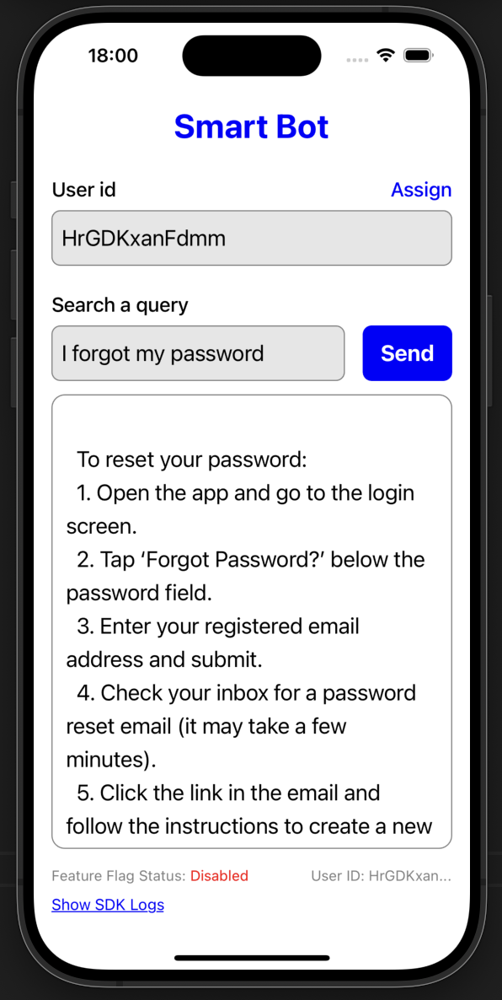 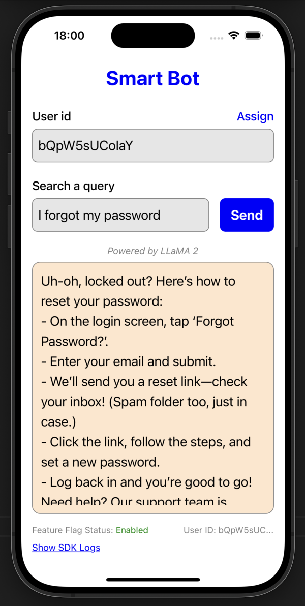 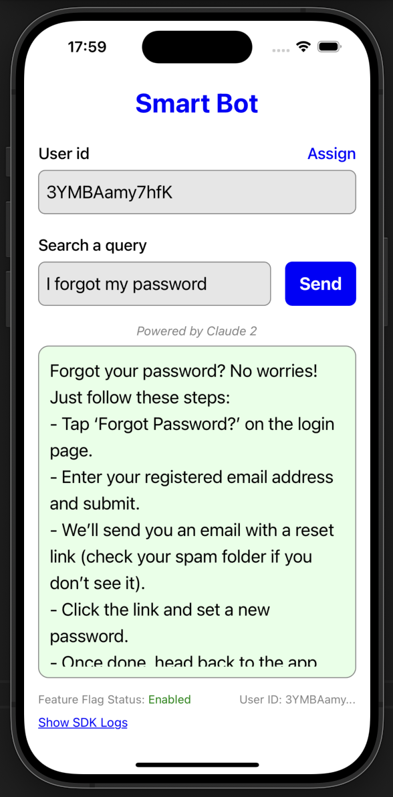 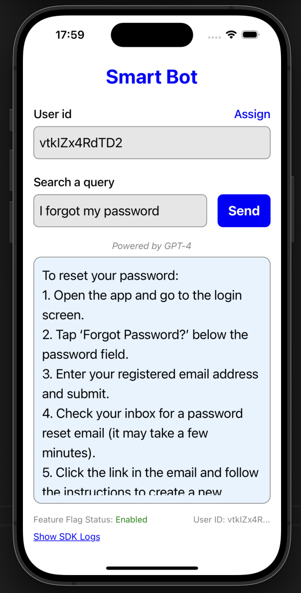 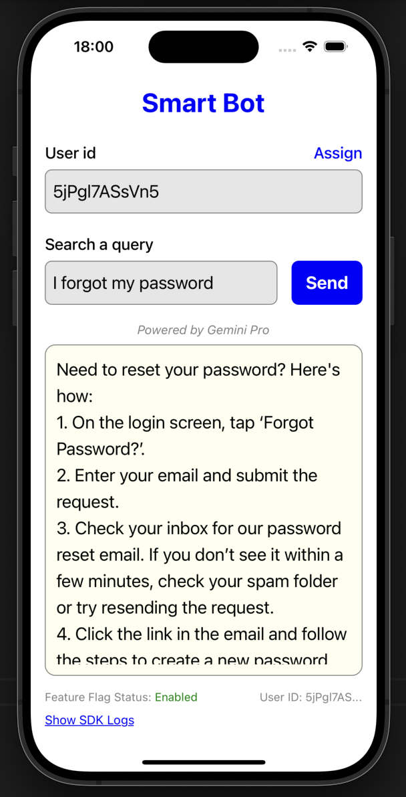


### Android Screenshots

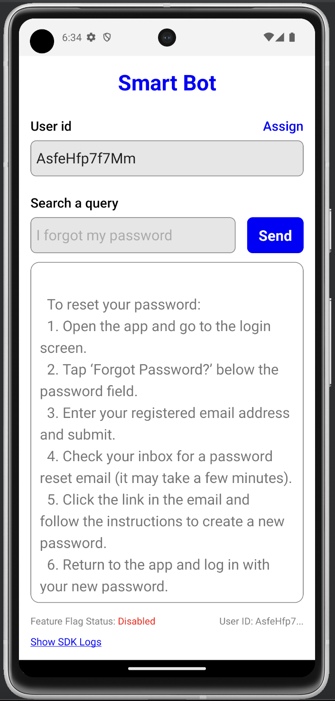 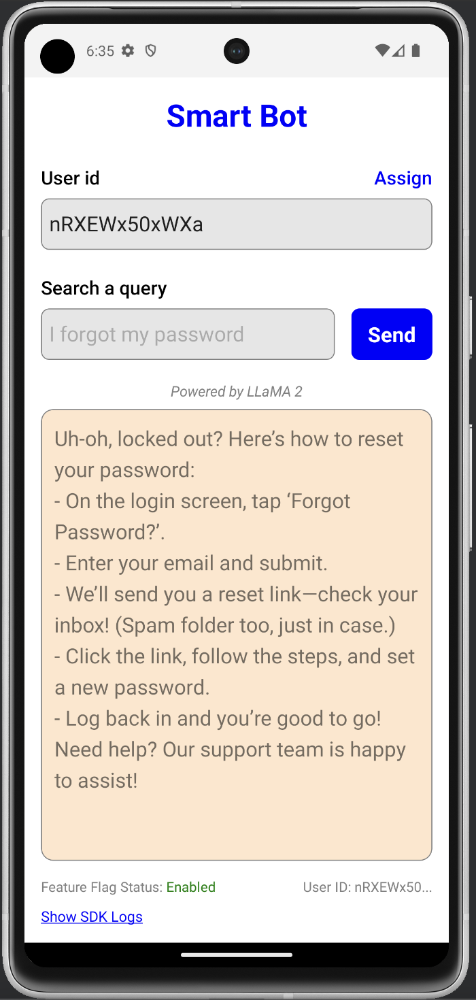 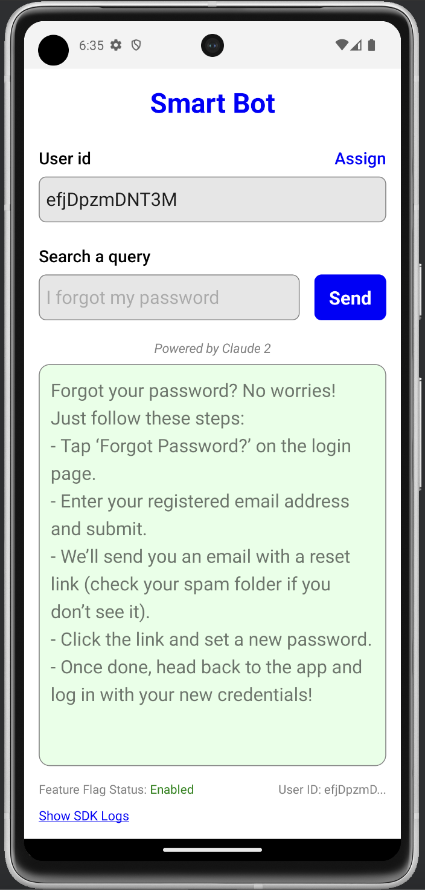 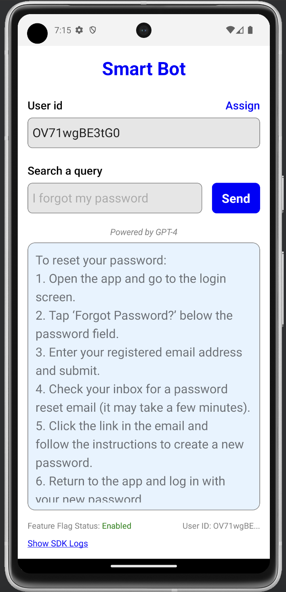 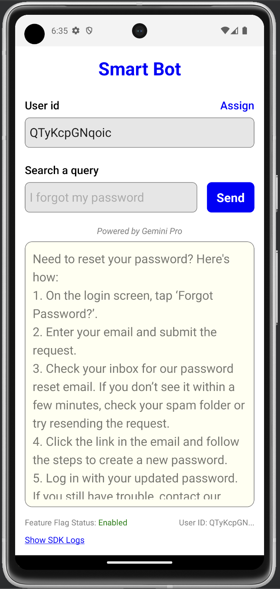
